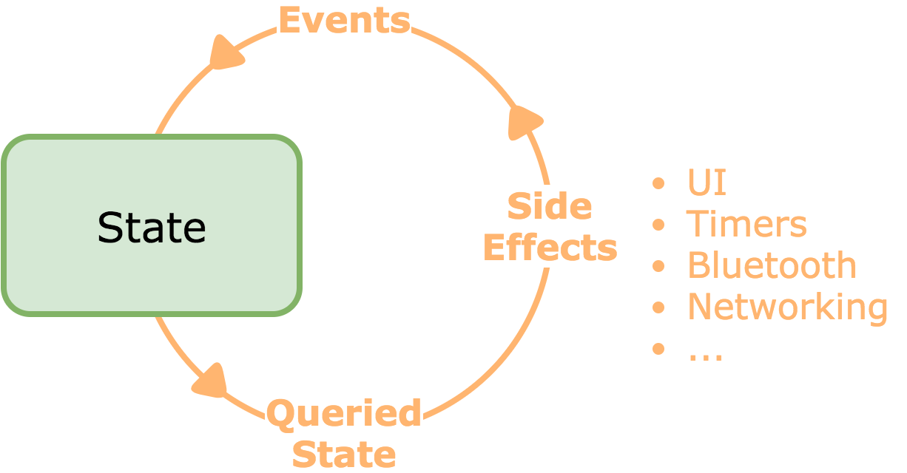

## [fit] RxSwift Classroom

### [fit]           FrenchKit 2017

Florent Pillet

**@fpillet**

Co-author, RxSwift book from Ray Wenderlich

---
## Agenda

* Setup
* Taming `flatMap()`
* Learning to `share()`
* Introducing `RxFeedback`

---
## Prepare for the class

* Clone `https://github.com/FrenchKit/RxSwiftClassroom`
* Open `Playground/Playground.xcworkspace`
* Build `RxSwift-macOS` scheme

---
## Taming flatMap

---
### Taming flatMap

Use `flatMap` whenever `map`ing to a single value is not enough

Most crucial and useful operator to know inside out

---
### 1. Regular flatMap

Turn input into a network request

---
### 2. Errors

Beware errors emitted by inner sequences

---
### 3. Errors, the right way

Catching errors _inside_ `flatMap` prevents breaking the overall sequence

---
### 4. Using flatMapLatest

When you only want to see the freshest results

---
## Learning to share

---
### Expensive observables

* Computation (i.e. preparing thuumbnails)
* Network requests
* Side effects

---
### Forms of share

* `share()`
* `shareReplay(_:)`
* `shareReplayLatestWhileConnected()`
* `share(replay:scope:)`

---
### Standard `share()`

* Subscribes to inner observable with first observer
* Unsubscribes when no more observers
* ⚠️ Side effect: zero observers = next observer restarts inner subscription

---
### `shareReplay`

* Replays the last N emitted elements
* Event if # subscribers fell to zero

👉  Experiment with the playground!

---
### `shareReplayLatestWhileConnected`

* Replays the last emitted element
* Clears buffer when no more subscribers

---
### `share(replay:scope:)`

* Most flexible variant
* Control whether buffering 'sticks' when subscribers drop to zero

---
# Introducing RxFeedback

---
# Introducing RxFeedback

https://github.com/kzaher/RxFeedback

`pod 'RxFeedback'`

---
### State machines

* Describe states of a system
* Transition description semantics
* How do you describe feedback?

---
### Feedback?

* A new state triggers a set of inputs
* Inputs produce events, sooner of later
* Events can be turned into a new state

---
### RxFeedback: all-in-one solution

---
### RxFeedback: all-in-one solution

* Describes the entire system: reducer, inputs, events
* Flexible inputs adjusting for each state
* Model circular dependencies

---
### Example project

* Simple media player to cycle between images
* A few states, easy to understand

👉 open `RxFeedbackDemo` project
👉 run app

---
### States & events

* I named events 'commands', better suited to this project

👉 examine `PlaybackStates.swift`
👉 examine `PlaybackCommand.swift`

---
### RxFeedback: a single operator (mostly)

* `Observable.system`
* Describes a complete system
* Event reducer
* Scheduler
* Feedback loops

---
### Reducer

* Barbaric name for a simple concept
* Reduces a command to a new state
* Try resist performing side effects here

---
### Reducer

* `reducePlaybackStateFromCommand` function
* simple switch-case clearly describes what happens

---
### Scheduler

* Use an asynchronous scheduler
* Prevents issue when doing immediate transitions
* RxFeedback does it for you, mostly

---
### Feedback loops

* One or more closures, called only *once*
* Observe a sequence of states
* Produce a sequence of comments

---
### Feedback loops

* `generateCommandsFromPlaybackStates`
* Observe the sequence of states
* On change, produce either `empty()` (empty sequence)
* ... or a timer that triggers to play the next image

---
### Feedback loops

* `flatMapLatest` 💪

---
### UI binding

* `bindUI`
* 😱
* Convoluted but not that complicated

---
### UI binding

* "observers" update UI from state
* "emitters" produce commands from user input
* commands go feed the beast

---
### Putting it all together

* Initial state goes into feedback loop
* Our example does nothing
* "Play" button triggers initial `playing` state
* `playing` initiates timer
* `playing` enables `pause` button
* It all goes on from

---
# Final words

---
# [fit] Discussion / Q&A

 
 
 
I'm Florent Pillet

**@fpillet** on Twitter, Slack, gmail and everywhere else

Co-author, RxSwift book from Ray Wenderlich
[https://store.raywenderlich.com/products/rxswift](https://store.raywenderlich.com/products/rxswift)
